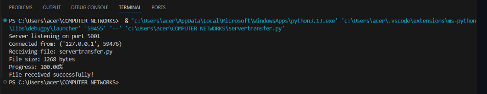

# 3c.CREATION FOR FILE TRANSFER USING TCP SOCKETS
## AIM
To write a python program for creating File Transfer using TCP Sockets Links
## ALGORITHM:
1. Import the necessary python modules.
2. Create a socket connection using socket module.
3. Send the message to write into the file to the client file.
4. Open the file and then send it to the client in byte format.
5. In the client side receive the file from server and then write the content into it.
## PROGRAM
```
server
import socket
import struct

SERVER_HOST = "127.0.0.1"
SERVER_PORT = 5001
BUFFER_SIZE = 4096

server = socket.socket(socket.AF_INET, socket.SOCK_STREAM)
server.bind((SERVER_HOST, SERVER_PORT))
server.listen(1)

print("Server listening on port", SERVER_PORT)

conn, addr = server.accept()
print("Connected from:", addr)

try:
    # Receive filename length first (4 bytes)
    filename_length = struct.unpack('I', conn.recv(4))[0]

    # Receive filename
    filename = conn.recv(filename_length).decode()

    # Receive file size (8 bytes)
    filesize = struct.unpack('Q', conn.recv(8))[0]

    print(f"Receiving file: {filename}")
    print(f"File size: {filesize} bytes")

    received_size = 0

    with open("received_" + filename, "wb") as f:
        while received_size < filesize:
            bytes_read = conn.recv(BUFFER_SIZE)
            if not bytes_read:
                break
            f.write(bytes_read)
            received_size += len(bytes_read)

            progress = (received_size / filesize) * 100
            print(f"Progress: {progress:.2f}%", end="\r")

    print("\nFile received successfully!")

except Exception as e:
    print("Error:", e)

finally:
    conn.close()
    server.close()
client
import socket
import os
import struct

SERVER_HOST = "127.0.0.1"
SERVER_PORT = 5001
BUFFER_SIZE = 4096

client = socket.socket(socket.AF_INET, socket.SOCK_STREAM)
client.connect((SERVER_HOST, SERVER_PORT))

try:
    filename = input("Enter file name to send: ")

    if not os.path.exists(filename):
        print("File does not exist!")
        client.close()
        exit()

    filesize = os.path.getsize(filename)

    # Send filename length (4 bytes)
    client.send(struct.pack('I', len(filename)))

    # Send filename
    client.send(filename.encode())

    # Send filesize (8 bytes)
    client.send(struct.pack('Q', filesize))

    print(f"Sending {filename} ({filesize} bytes)")

    sent_size = 0

    with open(filename, "rb") as f:
        while True:
            bytes_read = f.read(BUFFER_SIZE)
            if not bytes_read:
                break
            client.sendall(bytes_read)
            sent_size += len(bytes_read)

            progress = (sent_size / filesize) * 100
            print(f"Progress: {progress:.2f}%", end="\r")

    print("\nFile sent successfully!")

except Exception as e:
    print("Error:", e)

finally:
    client.close()
```
## OUPUT


## RESULT
Thus, the python program for creating File Transfer using TCP Sockets Links was 
successfully created and executed.
